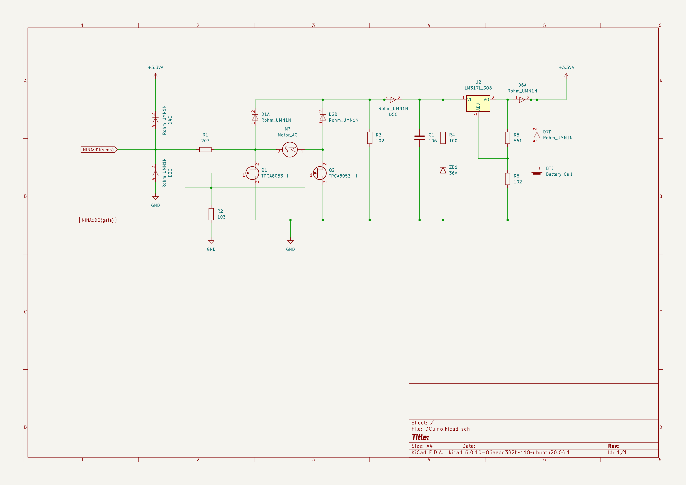
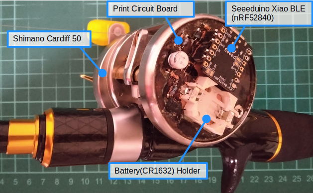
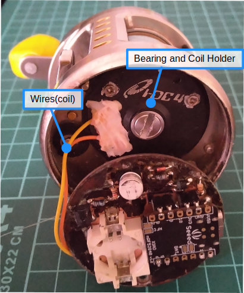
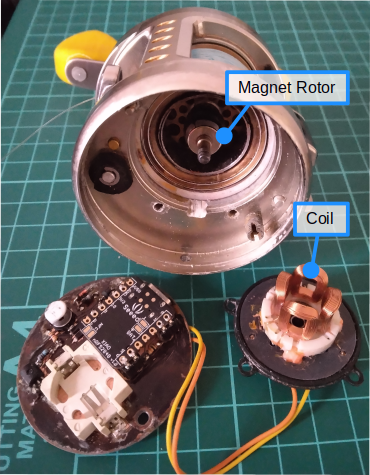

# OpenDCb
The most important element of baitcasting reel is the brake technology. This dominates the whole performance of baitcasting reel, that is "Long distance without Backlash".
Digital control technology may be the most sophisticated solution for this problem. Shimano succeeded to realize it as [Digital Control Braking technology(DC brake)](https://www.youtube.com/watch?v=iy6fYpK1zhY) in 2003, but no other manufacture has provided it yet. The drawback of DC brake is it is completeley "untouchable" device, so no one can explore or modify it.
OpenDCb(rake) intends to open this technology as "Digital Casting brake", and help those who want to take this technolgy in their hands.

## The Goals

1. Firmware
Arduino is the best entrance gate for a new commer of the embedded system. So we designed the software to run with Arduino. We selected [Seeeduino Xiao BLE](https://www.seeedstudio.com/Seeed-XIAO-BLE-nRF52840-p-5201.html) for the circuit shown later.

2. Circuit diagram
The circuit is comprised with only discrete devices, no need of special devices as Hole-IC to detect spool revolution.

3. Design rules of principal parts
The principal parts are a coil and a magnet rotor. We reveal the design rule for these parts.

4. Monitoring and Setting tools
Due to the usage of casting reel, the wireless communication is needed for testing.

## Firmware
Whole source code for Digital Casting brake technology are revealed under the "arduino/dcuino2" directory. It needs an "Additional Boards Manager" and "Additional Libralies". The followng URL is helpful for the installation.

[Getting Started with Seeed Studio XIAO nRF52840 (Sense)](https://wiki.seeedstudio.com/XIAO_BLE/)

#### Additional Libralies and patches
Following additinal libraries are needed under "arduino/libraries" directory.
1. ArduinoBLE
2. FS_Nano33BLE
3. NRF52_MBED_TimerInterrupt

For the FS_Nano33BLE, the following patch is necessary, because of the difference of hex code address range.
At line #149-
~~~
  #if !defined(NANO33BLE_FS_START)
    #if defined(ARDUINO_ARDUINO_NANO33BLE)
      #define NANO33BLE_FS_START           (NANO33BLE_FLASH_SIZE - (NANO33BLE_FS_SIZE_KB * 1024))
    #elif defined(ARDUINO_SEEED_XIAO_NRF52840) || defined(ARDUINO_SEEED_XIAO_NRF52840_SENSE)
      #define NANO33BLE_FS_START           (NANO33BLE_FLASH_SIZE - (NANO33BLE_FS_SIZE_KB * 1024)-0xC000)
    #else
      #error TARGET not defined
    #endif
  #endif
~~~ 

#### Specification
1. Full automatic brake adjustment with tension control
2. PWM switching sound
3. Comfortable with sensorless circuit
4. Communication via BLE

## Circuit diagram

## Monitoring and Setting

## Setting procedure
1. Zero calibration

## Prototypes

